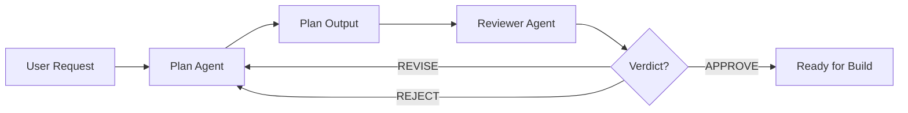

# agentic

Agents and skills for Opencode. Includes a planning agent that produces decision-complete execution plans, a reviewer agent that acts as a devil's advocate to find flaws in plans and code reviews, and a hindsight skill for session-end self-improvement.

## What this is

Three deliverables, one relationship:

- `prompts/<agent-name>.md` — the canonical portable prompt. Harness-agnostic prose.
- `agents/<agent-name>.md` — the Opencode agent. Frontmatter + verbatim prompt body.
- `skills/<skill-name>/SKILL.md` — the OpenCode skill. Frontmatter + instructions.

The invariant: **the agent body is the prompt verbatim.** When the prompt changes, re-sync the agent body.

## Agents

### Plan Agent

Produces decision-complete execution plans with the five-section contract (Context / Approach / Critical files & anchors / Verification / Assumptions & contingencies), concrete edits, grounded discovery, and no unsolicited padding.

After completing the plan, automatically invokes the Reviewer agent to review the plan for flaws.

### Reviewer Agent

Acts as a devil's advocate to identify flaws, edge cases, and missed considerations in plans and code reviews. Runs in a separate context window to avoid carrying forward assumptions.

The Reviewer produces a structured review with:
- Review Summary
- Critical Issues
- Concerns
- Minor Observations
- Verdict (APPROVE / REVISE / REJECT)

## Skills

### Hindsight

A session-end self-improvement skill that reviews everything accomplished in a session, distills genuine process lessons, and saves the durable ones as persistent memory. Trigger on:
- "get some hindsight"
- "run a hindsight pass"
- "what should we improve"
- "review today and notate lessons"
- "what did you learn today"
- "save what's worth remembering from this session"

Memory is stored at `~/.opencode/projects/<project-slug>/memory/`.

The skill is located at `skills/hindsight/SKILL.md` and deployed to `.opencode/skills/hindsight/SKILL.md`.

## Persistent Memory

The project maintains lessons learned from past sessions in `~/.opencode/projects/agentic/memory/`. These lessons are automatically loaded at the start of each session through `AGENTS.md`, which all agents are required to read.

**Memory location:** `~/.opencode/projects/agentic/memory/`

**How it works:**
- `AGENTS.md` instructs all agents to read `MEMORY.md` at session start
- `MEMORY.md` is the index listing all lessons
- Individual lesson files (e.g., `001-deployment-infrastructure.md`) contain the full lesson content
- The hindsight skill writes new lessons to this directory

**Current lessons:**
1. Deployment Infrastructure — Always update deployment scripts when adding new agents or skills
2. Avoid Hardcoding — Don't hardcode provider-specific values in portable agents
3. Clarify Requirements — Ask clarifying questions before implementing complex features
4. Test Integration — Test agent orchestration integration points early and iterate
5. Document Memory — Document memory system conventions for skills clearly

See `AGENTS.md` for the complete memory loading mechanism.

## Agent Orchestration

The Plan agent automatically invokes the Reviewer after completing a plan. This ensures every plan is reviewed for flaws before implementation.



The Build agent (not yet created) can also manually invoke the Reviewer for code reviews.

## Layout

```
agentic/
├── prompts/
│   ├── plan-mode.md          # Canonical Plan prompt
│   └── reviewer.md           # Canonical Reviewer prompt
├── agents/
│   ├── plan.md               # Opencode Plan agent (frontmatter + verbatim body)
│   └── reviewer.md           # Opencode Reviewer agent (hidden, frontmatter + verbatim body)
├── skills/
│   └── hindsight/
│       └── SKILL.md          # Hindsight skill
├── deploy.ps1                # PowerShell deployment script
├── deploy.sh                 # Bash deployment script
├── AGENTS.md                # Project instructions (memory loading, conventions)
└── README.md
```

| Path | Purpose |
|---|---|
| `prompts/plan-mode.md` | Canonical Plan prompt. |
| `prompts/reviewer.md` | Canonical Reviewer prompt. |
| `agents/plan.md` | Opencode Plan agent. Body is `prompts/plan-mode.md` verbatim. |
| `agents/reviewer.md` | Opencode Reviewer agent. Body is `prompts/reviewer.md` verbatim. |
| `skills/hindsight/SKILL.md` | Hindsight skill for session-end self-improvement. |
| `AGENTS.md` | Project instructions. Instructs agents to load persistent memory at session start. |

## Deployment

The deployment scripts install agents, skills, and the AGENTS.md file:

**PowerShell (Windows):**

```powershell
# Global (all projects)
.\deploy.ps1

# Per-project
.\deploy.ps1 -Project .
```

**Bash (Unix-like):**

```bash
# Global (all projects)
./deploy.sh

# Per-project
./deploy.sh --project .
```

The scripts deploy:
- **Agents** to `~/.config/opencode/agents/` (global) or `<project>/.opencode/agents/` (per-project)
- **Skills** to `~/.config/opencode/skills/` (global) or `<project>/.opencode/skills/` (per-project)
- **AGENTS.md** to `~/.config/opencode/AGENTS.md` (global) or `<project>/.opencode/AGENTS.md` (per-project)

### AGENTS.md Deployment Behavior

The deployment scripts handle AGENTS.md intelligently:

- **If AGENTS.md exists at the target location:** The script creates a backup (`AGENTS.md.bak`), then appends the project's AGENTS.md content to the existing file. This preserves global instructions while adding project-specific ones.

- **If AGENTS.md does not exist:** The script copies the project's AGENTS.md to the target location.

This ensures that global AGENTS.md files (with instructions for all projects) are not overwritten by project-specific deployments.

### Manual deployment

**Global (all projects):**

```sh
# Agents
mkdir -p ~/.config/opencode/agents
cp agents/plan.md ~/.config/opencode/agents/plan.md
cp agents/reviewer.md ~/.config/opencode/agents/reviewer.md

# Skills
mkdir -p ~/.config/opencode/skills/hindsight
cp skills/hindsight/SKILL.md ~/.config/opencode/skills/hindsight/SKILL.md

# AGENTS.md
cp AGENTS.md ~/.config/opencode/AGENTS.md
```

PowerShell:

```powershell
# Agents
New-Item -ItemType Directory -Force ~/.config/opencode/agents | Out-Null
Copy-Item agents\plan.md ~/.config\opencode\agents\plan.md
Copy-Item agents\reviewer.md ~/.config\opencode\agents\reviewer.md

# Skills
New-Item -ItemType Directory -Force ~/.config/opencode/skills/hindsight | Out-Null
Copy-Item skills\hindsight\SKILL.md ~/.config\opencode\skills\hindsight\SKILL.md

# AGENTS.md
Copy-Item AGENTS.md ~/.config\opencode\AGENTS.md
```

**Per-project:**

```sh
# Agents
mkdir -p <project>/.opencode/agents
cp agents/plan.md <project>/.opencode/agents/plan.md
cp agents/reviewer.md <project>/.opencode/agents/reviewer.md

# Skills
mkdir -p <project>/.opencode/skills/hindsight
cp skills/hindsight/SKILL.md <project>/.opencode/skills/hindsight/SKILL.md

# AGENTS.md
cp AGENTS.md <project>/.opencode/AGENTS.md
```

PowerShell:

```powershell
# Agents
New-Item -ItemType Directory -Force <project>/.opencode/agents | Out-Null
Copy-Item agents\plan.md <project>/.opencode\agents\plan.md
Copy-Item agents\reviewer.md <project>/.opencode\agents\reviewer.md

# Skills
New-Item -ItemType Directory -Force <project>/.opencode/skills/hindsight | Out-Null
Copy-Item skills\hindsight\SKILL.md <project>/.opencode\skills\hindsight\SKILL.md

# AGENTS.md
Copy-Item AGENTS.md <project>/.opencode\AGENTS.md
```

## Install & verify

1. **Copy the agent and skill files** to the expected location (see above).

2. **Verify agent registration:**
   ```sh
   opencode agent list
   ```
   Expected output: `plan (primary)` and `reviewer (subagent)` entries.

## Usage

### Plan Agent

**TUI:** Switch to the `plan` agent, paste the request, review the plan, then switch to the Build agent to implement.

**CLI:**

```sh
opencode run --agent plan --model <model-id> "<request>"
```

### Reviewer Agent

**Manual invocation:**

```sh
opencode run --agent reviewer --prompt "Review this plan: <plan content>"
```

**Automatic invocation:** The Plan agent automatically invokes the Reviewer after completing a plan.

### Hindsight Skill

**Trigger phrases:**
- "get some hindsight"
- "run a hindsight pass"
- "what should we improve"
- "review today and notate lessons"
- "what did you learn today"
- "save what's worth remembering from this session"

**Behavior:**
- Reviews the full session end-to-end
- Extracts durable process lessons (not one-off specifics)
- Saves lessons as persistent memory at `~/.opencode/projects/<project-slug>/memory/`
- Updates existing memory entries instead of creating duplicates
- If no memory system exists, produces a standalone document

## Permission model

### Plan Agent

Fully read-only for exploration. File edits, shell commands, and subagent delegation are denied; `todowrite` is allowed only for planning-state tracking. The `task` permission is allowed to invoke the Reviewer subagent.

### Reviewer Agent

Fully read-only. File edits, shell commands, and subagent delegation are denied. The Reviewer reads plans and code from scratch without prior context.

## Keeping prompt and agent in sync

When `prompts/<agent-name>.md` changes, copy it verbatim into `agents/<agent-name>.md` as the body (the frontmatter stays unchanged), then re-deploy.

## Behaviors & troubleshooting

- **Provider flake:** Some providers occasionally return empty completions or truncate at the output-token limit. Fix: rerun the request.
- **Don't trust the model's self-reported tool list** ("list every tool available to you"). Models omit tools from their enumeration. Trust `opencode agent list` instead.
