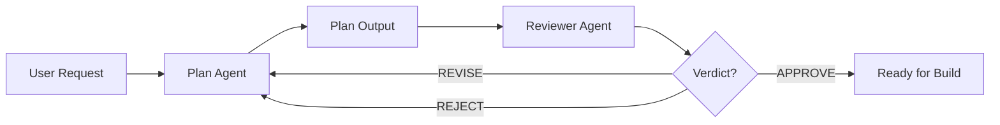

# agentic

Agents and skills for Opencode. Includes a planning agent that produces decision-complete execution plans, a reviewer agent that acts as a devil's advocate to find flaws in plans and code reviews, and a hindsight skill for session-end self-improvement.

## What this is

Four deliverables, one relationship:

- `prompts/<agent-name>.md` — the canonical portable prompt. Harness-agnostic prose.
- `agents/<agent-name>.md` — the Opencode agent. Frontmatter + verbatim prompt body.
- `skills/<skill-name>/SKILL.md` — the OpenCode skill. Frontmatter + instructions.
- `config/agentic.opencode.json` — the MCP servers, skill sources and plugins the deployment installs.

The invariant: **the agent body is the prompt verbatim.** When the prompt changes, re-sync the agent body.

## Agents

### Plan Agent

Produces decision-complete execution plans with the five-section contract (Context / Approach / Critical files & anchors / Verification / Assumptions & contingencies), concrete edits, grounded discovery, and no unsolicited padding.

After completing the plan, automatically invokes the Reviewer agent to review the plan for flaws.

### Reviewer Agent

Acts as a devil's advocate to identify flaws, edge cases, and missed considerations in plans and code reviews. Runs in a separate context window to avoid carrying forward assumptions.

The Reviewer produces a structured review with:
- Review Summary
- Critical Issues
- Concerns
- Minor Observations
- Verdict (APPROVE / REVISE / REJECT)

## Skills

### Hindsight

A session-end self-improvement skill that reviews everything accomplished in a session, distills genuine process lessons, and saves the durable ones as persistent memory. Trigger on:
- "get some hindsight"
- "run a hindsight pass"
- "what should we improve"
- "review today and notate lessons"
- "what did you learn today"
- "save what's worth remembering from this session"

Memory is stored globally at `~/.opencode/memory/`.

The skill is located at `skills/hindsight/SKILL.md` and deployed to `.opencode/skills/hindsight/SKILL.md`.

### Karpathy Guidelines

Behavioral guidelines to reduce common LLM coding mistakes, derived from [Andrej Karpathy's observations](https://x.com/karpathy/status/2015883857489522876). Loaded automatically by the Plan and Reviewer agents at session start. Four principles in priority order:

1. **Goal-Driven Execution** (highest priority) — Transform tasks into verifiable goals with success criteria; loop until verified.
2. **Think Before Coding** — State assumptions explicitly; surface tradeoffs; push back when warranted.
3. **Simplicity First** — Minimum code that solves the problem; nothing speculative.
4. **Surgical Changes** — Touch only what you must; clean up only your own mess.

The skill is located at `skills/karpathy-guidelines/SKILL.md` and deployed to `.opencode/skills/karpathy-guidelines/SKILL.md`.

### Caveman

Ultra-compressed communication mode that cuts output tokens while keeping technical accuracy. Loaded by default for Plan and Reviewer agents. It can also be activated manually via `/caveman`, "caveman mode", "talk like caveman", "be brief", or "less tokens". Four intensity levels: lite, full (default), ultra, and wenyan variants (classical Chinese). Derived from [JuliusBrussee/caveman](https://github.com/JuliusBrussee/caveman).

The skill is located at `skills/caveman/SKILL.md` and deployed to `.opencode/skills/caveman/SKILL.md`.

## Persistent Memory

The project maintains global lessons learned from past sessions in `~/.opencode/memory/`. These lessons are automatically loaded at the start of each session through `AGENTS.md`, which all agents are required to read.

**Memory location:** `~/.opencode/memory/`

**How it works:**
- `AGENTS.md` instructs all agents to read `MEMORY.md` at session start
- `MEMORY.md` is the index listing all lessons
- Individual lesson files (e.g., `001-deployment-infrastructure.md`) contain the full lesson content
- The hindsight skill writes new lessons to this directory

### Proactive Hindsight Suggestions

After an implementation that required iteration or course correction, agents should suggest a hindsight pass. They should not run it automatically and should not suggest it after straightforward tasks or ordinary planning conversations.

### Cross-platform paths

`~/.opencode/memory/` is a home-relative logical path. On Unix-like systems it resolves under `/home/<user>/` or `/Users/<user>/`; on Windows it resolves under `C:\Users\<user>\`. Agents must resolve the user's home directory instead of hardcoding a platform-specific path.

### Permission configuration

To avoid repeated approval prompts when agents read or update global memory, add these rules to the global OpenCode config at `~/.config/opencode/opencode.jsonc` (on Windows, use the equivalent OpenCode configuration directory):

```jsonc
{
  "$schema": "https://opencode.ai/config.json",
  "permissions": [
    { "action": "external_directory", "resource": "~/.opencode/memory/*", "effect": "allow" },
    { "action": "read", "resource": "~/.opencode/memory/*", "effect": "allow" },
    { "action": "edit", "resource": "~/.opencode/memory/*", "effect": "allow" }
  ]
}
```

OpenCode expands the `~` prefix using the current user's home directory. Preserve the home-relative form on Windows; do not copy the Unix `/home/<user>/` example into Windows configuration.

**Current lessons:**
1. Deployment Infrastructure — Always update deployment scripts when adding new agents or skills
2. Avoid Hardcoding — Don't hardcode provider-specific values in portable agents
3. Clarify Requirements — Ask clarifying questions before implementing complex features
4. Test Integration — Test agent orchestration integration points early and iterate
5. Document Memory — Document memory system conventions for skills clearly

See `AGENTS.md` for the complete memory loading mechanism.

## Agent Orchestration

The Plan agent automatically invokes the Reviewer after completing a plan. This ensures every plan is reviewed for flaws before implementation.


```mermaid
graph LR
    A[User Request] --> B[Plan Agent]
    B --> C[Plan Output]
    C --> D[Reviewer Agent]
    D --> E{Verdict?}
    E -->|APPROVE| F[Ready for Build]
    E -->|REVISE| B
    E -->|REJECT| B
```

The Build agent (not yet created) can also manually invoke the Reviewer for code reviews.

## Layout

```
agentic/
├── prompts/
│   ├── plan-mode.md          # Canonical Plan prompt
│   └── reviewer.md           # Canonical Reviewer prompt
├── agents/
│   ├── plan.md               # Opencode Plan agent (frontmatter + verbatim body)
│   └── reviewer.md           # Opencode Reviewer agent (hidden, frontmatter + verbatim body)
├── skills/
│   ├── hindsight/
│   │   └── SKILL.md          # Hindsight skill
│   ├── karpathy-guidelines/
│   │   └── SKILL.md          # Karpathy guidelines skill
│   ├── grill-me/
│   │   ├── SKILL.md          # Plan/design interview skill
│   │   └── agents/openai.yaml
│   ├── caveman/
│   │   └── SKILL.md          # Caveman skill
│   └── stop-slop/            # Git submodule: hardikpandya/stop-slop
├── config/
│   └── agentic.opencode.json # MCP servers, skill sources, plugins
├── deploy.ps1                # PowerShell deployment script
├── deploy.sh                 # Bash deployment script
├── MCP.md                    # MCP server recommendations and install notes
├── AGENTS.md                # Project instructions (memory loading, conventions)
└── README.md
```

| Path | Purpose |
|---|---|
| `prompts/plan-mode.md` | Canonical Plan prompt. |
| `prompts/reviewer.md` | Canonical Reviewer prompt. |
| `agents/plan.md` | Opencode Plan agent. Body is `prompts/plan-mode.md` verbatim. |
| `agents/reviewer.md` | Opencode Reviewer agent. Body is `prompts/reviewer.md` verbatim. |
| `skills/hindsight/SKILL.md` | Hindsight skill for session-end self-improvement. |
| `skills/karpathy-guidelines/SKILL.md` | Karpathy guidelines skill for planning, writing, and reviewing code. |
| `skills/grill-me/SKILL.md` | Relentless interview to sharpen a plan or design. |
| `skills/caveman/SKILL.md` | Caveman skill for compressed communication style. |
| `skills/stop-slop` | Git submodule for `hardikpandya/stop-slop`. |
| `config/agentic.opencode.json` | Managed config merged into the target Opencode config. |
| `AGENTS.md` | Project instructions. Instructs agents to load persistent memory at session start. |

### Skills from other repositories

Three well-known skills were originally committed here as bare symlinks
(`skills/obra-superpowers`, `skills/stop-slop`, `skills/understand-anything`).
That could never work: the repo had no `.gitmodules`, so a clone produced empty
directories, and two of the three are multi-skill **plugin** repositories with
no root `SKILL.md` at all. They are now integrated the way each one actually
expects:

| Skill | Source | Mechanism |
|---|---|---|
| `stop-slop` | [hardikpandya/stop-slop](https://github.com/hardikpandya/stop-slop) | Git submodule. The repo root is a single skill (`SKILL.md` + `references/`), so it drops straight into `skills/`. |
| Superpowers (15 skills) | [obra/superpowers](https://github.com/obra/superpowers) | Opencode **plugin**, via the `plugin` config key. Ships its own OpenCode support in `.opencode/INSTALL.md`. |
| Understand Anything (9 skills) | [Egonex-AI/Understand-Anything](https://github.com/Egonex-AI/Understand-Anything) | External checkout plus a `skills` config entry pointing at its `understand-anything-plugin/skills` directory. |

Init the submodule after cloning:

```sh
git submodule update --init --recursive
```

Superpowers and Understand Anything are **not** submodules: both are large
multi-harness plugin repositories whose skills live in nested directories, and
Superpowers needs its bootstrap injection to work. Vendoring them would pin them
to a commit and skip upstream's cross-harness tooling.

`Egonex-AI/Understand-Anything` was formerly `Lum1104/Understand-Anything`; GitHub
redirects the old name, so either URL resolves.

### Plugin config key

The managed config uses **`plugin`** (singular). V1-line Opencode builds accept
the singular form and reject `plugins`; builds following the V2 config guide
expect `plugins`. If a plugin silently fails to load, check which spelling your
build wants:

```sh
grep -i 'normalization diagnostic' ~/.local/share/opencode/log/opencode.log
```

A rejected key is reported as `path=$.plugin kind=invalid action="skipped"`.

## Deployment

The deployment scripts install agents, skills, and the AGENTS.md file:

**PowerShell (Windows):**

```powershell
# Global (all projects)
.\deploy.ps1

# Per-project
.\deploy.ps1 -Project .
```

**Bash (Unix-like):**

```bash
# Global (all projects)
./deploy.sh

# Per-project
./deploy.sh --project .
```

The scripts deploy:
- **Agents** to `~/.config/opencode/agents/` (global) or `<project>/.opencode/agents/` (per-project)
- **Skills** to `~/.config/opencode/skills/` (global) or `<project>/.opencode/skills/` (per-project)
- **Prompts** to `~/.config/opencode/commands/` (global) or `<project>/.opencode/commands/` (per-project), so each prompt becomes a slash command (`prompts/plan-mode.md` → `/plan-mode`)
- **MCP servers, skill sources and plugins** merged from `config/agentic.opencode.json` into `~/.config/opencode/opencode.jsonc` (global) or `<project>/.opencode/opencode.jsonc` (per-project)
- **AGENTS.md** to `~/.config/opencode/AGENTS.md` (global) or `<project>/.opencode/AGENTS.md` (per-project)

Skip a section when you only want part of the deployment:

```powershell
.\deploy.ps1 -NoConfig
.\deploy.ps1 -NoPrompts
```

```bash
./deploy.sh --no-config
./deploy.sh --no-prompts
```

### Idempotency

Running a deployment twice produces the same result. This matters because the
global config directory is shared state that other tools also write to.

- **AGENTS.md** is wrapped in a pair of `agentic:begin` / `agentic:end` HTML
  comment markers. A repeat run replaces that block in place and leaves every
  other byte of the file alone. Older versions of these scripts appended
  unconditionally under a `<!-- Appended from agentic project -->` comment,
  which duplicated the whole block on every run; that legacy block is migrated
  into the marked block on the first run of the new scripts.
- **MCP servers** are merged by name. Only the keys defined in
  `config/agentic.opencode.json` are written; every other setting in the target
  config is preserved, including legacy servers declared directly under `mcp`.
- **`skills` and `plugin`** are merged as ordered unions: your existing entries
  keep their precedence and new ones are appended. Order matters for both.
- Object keys are sorted recursively so the written file is byte-stable across
  runs and reviewable in version control. Arrays keep their order. The previous
  file is saved as `<config>.bak`.

### Managed config merge

OpenCode loads exactly one extra config file, selected by the `OPENCODE_CONFIG`
environment variable. Dropping a second `*.opencode.json` file into the global
config directory does nothing — it is silently ignored. Everything the snippet
declares therefore has to be merged into the target's own `opencode.json(c)`.

The merge is JSONC-aware: line and block comments are stripped before parsing
and the file is rewritten as plain JSON. If the target contained comments, the
script warns you and the original is preserved at `<config>.bak`.

Secrets are never written into the config. The GitHub server reads its token
from `{env:GITHUB_PERSONAL_ACCESS_TOKEN}`.

### External checkouts

The deployment ensures the Understand Anything checkout exists at
`~/.understand-anything/repo` (override with `UA_DIR` / `UA_REPO_URL`), because
the managed `skills` entry points into it. **An existing checkout is never
updated** — a deployment must not silently move your dependency versions. Update
it yourself when you want to move:

```sh
git -C ~/.understand-anything/repo pull --ff-only
```

### Servers registered disabled

`config/agentic.opencode.json` ships two entries with `"disabled": true`:

| Server | Why |
|---|---|
| `graphify` | Serves a prebuilt `graphify-out/graph.json` from the working directory, so it only connects in a project where `graphify .` has been run. |
| `claude_context` | Needs a Zilliz Cloud account for the embedding backend. |

Flip `"disabled"` to `false` (or use `/mcps` in the TUI) once the prerequisite
exists. See `MCP.md` for prerequisites and corrected install commands.

### Troubleshooting

**A skill directory is skipped as "empty" or "SKILL.md not found".** Either the
submodule is unpopulated (`git submodule update --init --recursive`) or it is a
multi-skill plugin repository, which belongs in the config's `skills` array
rather than in `skills/`.

**A plugin or skill silently fails to load.** Check the server log for rejected
config keys:

```sh
grep -i 'normalization diagnostic' ~/.local/share/opencode/log/opencode.log
```

`action="skipped"` with `kind=invalid` names the offending path. Note that
`opencode mcp list` does **not** fully validate the config; start the server
(`opencode serve`) to surface every diagnostic.

**A git-backed plugin spec fails on Windows.** Upstream documents that some
Windows builds mishandle `git+https` specs. Fall back to a local install and
point the config at the absolute path (Opencode does not expand `~`):

```powershell
npm install superpowers@git+https://github.com/obra/superpowers.git --prefix "$HOME\.config\opencode"
```

then use `C:\Users\<you>\.config\opencode\node_modules\superpowers` as the
`plugin` entry.

### AGENTS.md Deployment Behavior

The deployment scripts handle AGENTS.md intelligently:

- **If AGENTS.md exists at the target location:** The script creates a backup (`AGENTS.md.bak`), then replaces its own marked block in place. This preserves global instructions while refreshing project-specific ones.

- **If AGENTS.md does not exist:** The script writes AGENTS.md containing the marked block.

This ensures that global AGENTS.md files (with instructions for all projects) are not overwritten by project-specific deployments.

### Manual deployment

**Global (all projects):**

```sh
# Agents
mkdir -p ~/.config/opencode/agents
cp agents/plan.md ~/.config/opencode/agents/plan.md
cp agents/reviewer.md ~/.config/opencode/agents/reviewer.md

# Skills
mkdir -p ~/.config/opencode/skills/hindsight
cp skills/hindsight/SKILL.md ~/.config/opencode/skills/hindsight/SKILL.md
mkdir -p ~/.config/opencode/skills/karpathy-guidelines
cp skills/karpathy-guidelines/SKILL.md ~/.config/opencode/skills/karpathy-guidelines/SKILL.md
mkdir -p ~/.config/opencode/skills/caveman
cp skills/caveman/SKILL.md ~/.config/opencode/skills/caveman/SKILL.md

# AGENTS.md
cp AGENTS.md ~/.config/opencode/AGENTS.md
```

PowerShell:

```powershell
# Agents
New-Item -ItemType Directory -Force ~/.config/opencode/agents | Out-Null
Copy-Item agents\plan.md ~/.config\opencode\agents\plan.md
Copy-Item agents\reviewer.md ~/.config\opencode\agents\reviewer.md

# Skills
New-Item -ItemType Directory -Force ~/.config/opencode/skills/hindsight | Out-Null
Copy-Item skills\hindsight\SKILL.md ~/.config\opencode\skills\hindsight\SKILL.md
New-Item -ItemType Directory -Force ~/.config/opencode/skills/karpathy-guidelines | Out-Null
Copy-Item skills\karpathy-guidelines\SKILL.md ~/.config\opencode\skills\karpathy-guidelines\SKILL.md
New-Item -ItemType Directory -Force ~/.config/opencode/skills/caveman | Out-Null
Copy-Item skills\caveman\SKILL.md ~/.config\opencode\skills\caveman\SKILL.md

# AGENTS.md
Copy-Item AGENTS.md ~/.config\opencode\AGENTS.md
```

**Per-project:**

```sh
# Agents
mkdir -p <project>/.opencode/agents
cp agents/plan.md <project>/.opencode/agents/plan.md
cp agents/reviewer.md <project>/.opencode/agents/reviewer.md

# Skills
mkdir -p <project>/.opencode/skills/hindsight
cp skills/hindsight/SKILL.md <project>/.opencode/skills/hindsight/SKILL.md
mkdir -p <project>/.opencode/skills/karpathy-guidelines
cp skills/karpathy-guidelines/SKILL.md <project>/.opencode/skills/karpathy-guidelines/SKILL.md
mkdir -p <project>/.opencode/skills/caveman
cp skills/caveman/SKILL.md <project>/.opencode/skills/caveman/SKILL.md

# AGENTS.md
cp AGENTS.md <project>/.opencode/AGENTS.md
```

PowerShell:

```powershell
# Agents
New-Item -ItemType Directory -Force <project>/.opencode/agents | Out-Null
Copy-Item agents\plan.md <project>/.opencode\agents\plan.md
Copy-Item agents\reviewer.md <project>/.opencode\agents\reviewer.md

# Skills
New-Item -ItemType Directory -Force <project>/.opencode/skills/hindsight | Out-Null
Copy-Item skills\hindsight\SKILL.md <project>/.opencode\skills\hindsight\SKILL.md
New-Item -ItemType Directory -Force <project>/.opencode/skills/karpathy-guidelines | Out-Null
Copy-Item skills\karpathy-guidelines\SKILL.md <project>/.opencode\skills\karpathy-guidelines\SKILL.md
New-Item -ItemType Directory -Force <project>/.opencode/skills/caveman | Out-Null
Copy-Item skills\caveman\SKILL.md <project>/.opencode\skills\caveman\SKILL.md

# AGENTS.md
Copy-Item AGENTS.md <project>/.opencode\AGENTS.md
```

## Install & verify

1. **Copy the agent and skill files** to the expected location (see above).

2. **Verify agent registration:**
   ```sh
   opencode agent list
   ```
   Expected output: `plan (primary)` and `reviewer (subagent)` entries.

## Usage

### Plan Agent

**TUI:** Switch to the `plan` agent, paste the request, review the plan, then switch to the Build agent to implement.

**CLI:**

```sh
opencode run --agent plan --model <model-id> "<request>"
```

### Reviewer Agent

**Manual invocation:**

```sh
opencode run --agent reviewer --prompt "Review this plan: <plan content>"
```

**Automatic invocation:** The Plan agent automatically invokes the Reviewer after completing a plan.

### Hindsight Skill

**Trigger phrases:**
- "get some hindsight"
- "run a hindsight pass"
- "what should we improve"
- "review today and notate lessons"
- "what did you learn today"
- "save what's worth remembering from this session"

**Behavior:**
- Reviews the full session end-to-end
- Extracts durable process lessons (not one-off specifics)
- Saves lessons as persistent memory at `~/.opencode/memory/`
- Updates existing memory entries instead of creating duplicates
- If no memory system exists, produces a standalone document

## Permission model

### Plan Agent

Fully read-only for exploration. File edits, shell commands, and subagent delegation are denied; `todowrite` is allowed only for planning-state tracking. The `task` permission is allowed to invoke the Reviewer subagent.

### Reviewer Agent

Fully read-only. File edits, shell commands, and subagent delegation are denied. The Reviewer reads plans and code from scratch without prior context.

## Keeping prompt and agent in sync

When `prompts/<agent-name>.md` changes, copy it verbatim into `agents/<agent-name>.md` as the body (the frontmatter stays unchanged), then re-deploy.

## Behaviors & troubleshooting

- **Provider flake:** Some providers occasionally return empty completions or truncate at the output-token limit. Fix: rerun the request.
- **Don't trust the model's self-reported tool list** ("list every tool available to you"). Models omit tools from their enumeration. Trust `opencode agent list` instead.
